# 🎮 3D Escape Room Experience

Welcome to our 3D **Terror Escape Room** project, set inside a **mysterious train**.  
This game was developed in a **custom C++ engine** provided by our professor during the university course.

---

## 👥 Team Members

Developed by:  
**Oriol Marion, Itziar Beltran, Eric Rodriguez, Martí Capel, Arnau Marcos, Guillermo Vivancos**

---

## ⚠️ Requirements

- 💻 **Visual Studio 2022 or higher**
  - The project will **not work on earlier versions**
  - Make sure to install **Desktop development with C++**

- 📦 Download full project files
    - git clone https://github.com/SunixDx/The-Train-Escape-Room.git

---

## ▶️ How to Play

1. Download the full project folder  
2. Locate and run the executable:
   ```bash
   EntornVGI.exe
   ```

✅ No need to compile if running from the compiled `.exe`  
💡 For development or debugging, open the `.sln` file with Visual Studio 2022+

---

## 🎮 Controls

| Key      | Action                                     |
|----------|--------------------------------------------|
| `W A S D` | Move player                               |
| `C`      | Crouch / Uncrouch / Stand Up / Leave Panel |
| `Left Click`  | Interact with elements                     |
| `ESC`    | Exit game                                  |

---

## 🧩 Features

- 🎥 **Multiple camera systems** (Main Menu, Escape Sequences, Static Angles)
- 🧱 **Collision system**
- 🧊 **Custom 3D models**
- 🌌 **Skybox environment**
- ⚙️ **Event-based interaction logic**
- 🌀 **Smooth movement and effects**
- 🔊 **Immersive environmental sounds**

---

## 🌌 Lighting

The game includes **4 different lighting systems**, helping set the mood:
- 🔦 Dynamic flashlight
- 💡 Ambient wagon lighting
- 🚨 Emergency red lights
- 🌘 Dark/no light for tension

---

## 🖼️ Screenshots

### 🎥 Camera Types (Menu, Escape, Static)

**Main Menu**
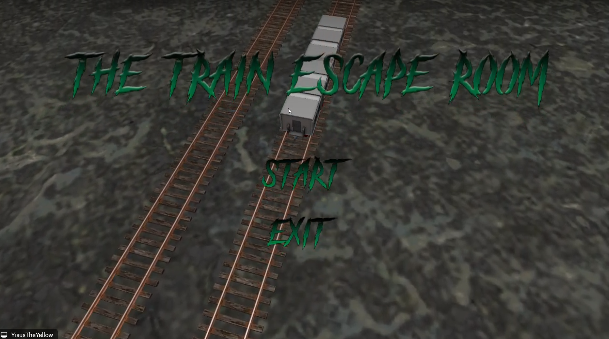

**Escape Moment**
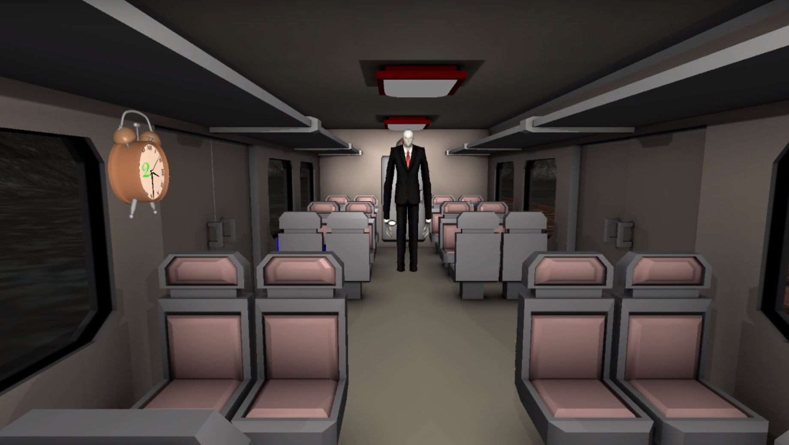

---

### 🚃 Inside the Train Wagon

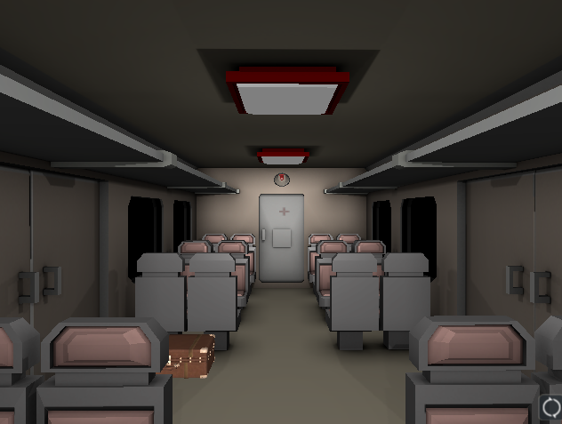

### 🚃 Outside the Train Wagon

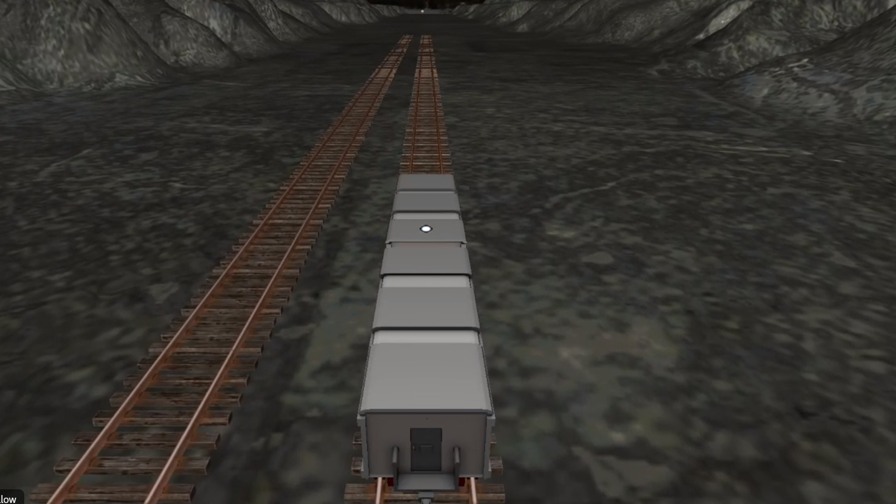

---

### 💡 Lighting Types

**Lighting Type 1**
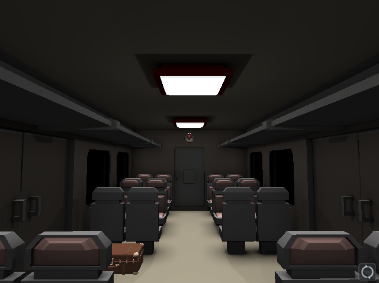

**Lighting Type 2**
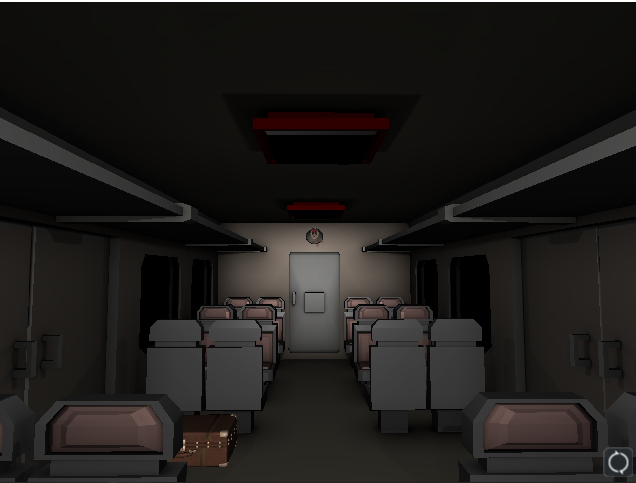

**Lighting Type 3**
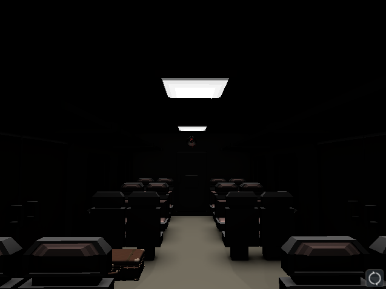

---

### 🔐 Panels and Puzzles


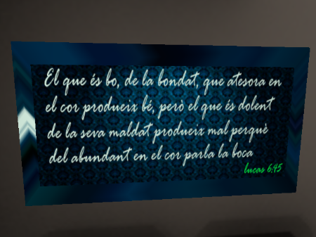
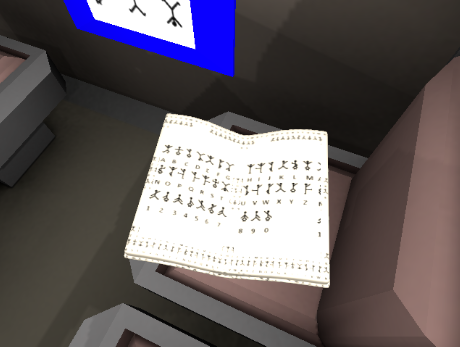
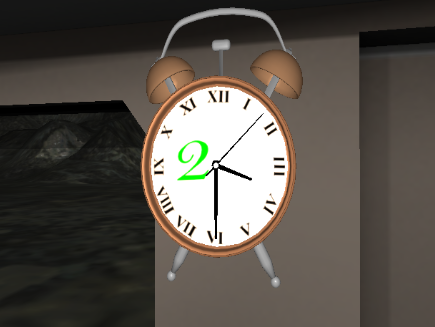
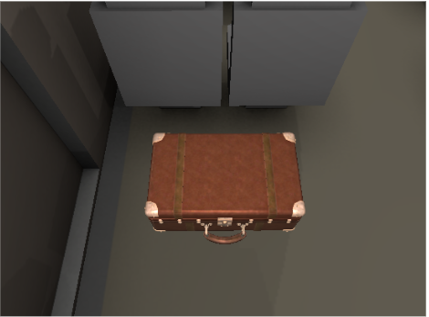
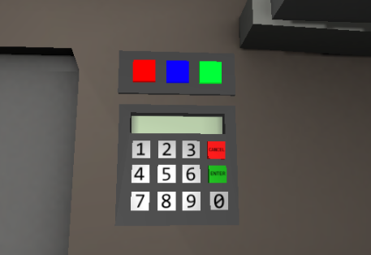

---

## 🧠 Themes

- 🧩 **Escape Room**
- 🚂 **Train setting**
- 😱 **Terror / Horror atmosphere**

---

## 📌 Notes

- The game was developed inside a **custom university engine**. It is **not portable** to other engines or systems.
- All files must remain in their original structure to avoid execution issues.
- You may need admin rights depending on your system.

---
